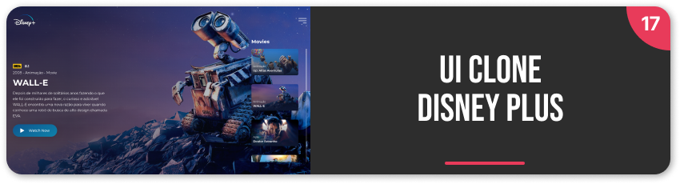
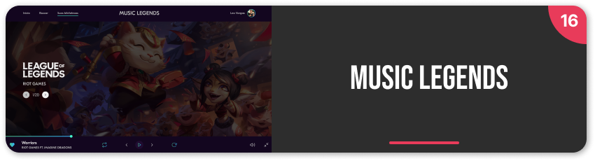
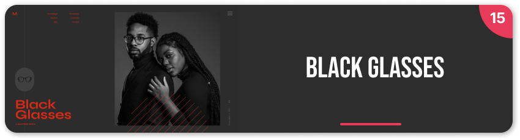
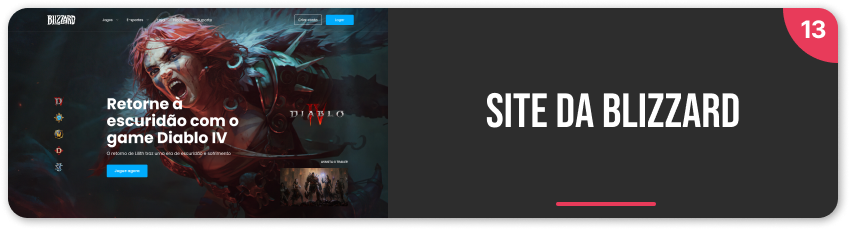
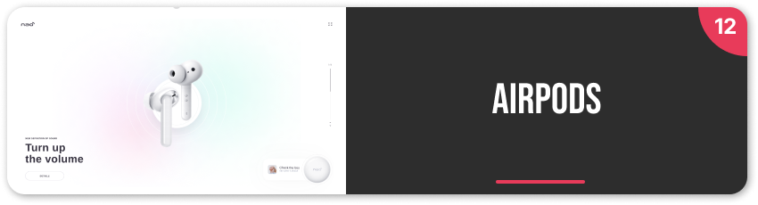
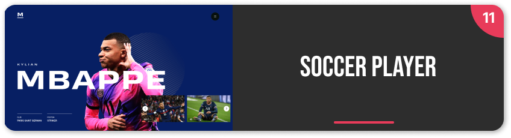
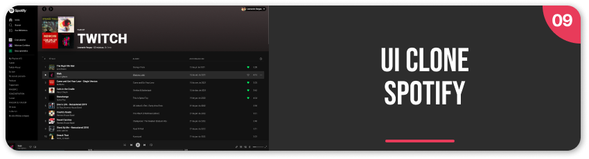
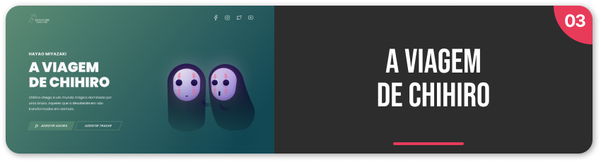

<h1 align="center">
  Lives Twitch
</h1>

<h3 align="center">
  Projetos desenvolvidos em <i>livecoding</i> na <a href="https://www.twitch.tv/leovargasdev">Twitch.tv</a>
</h3>

<ul>
  <li><a href="#live-17">Live 17 • UI Clone - Disney Plus</a></li>
  <li><a href="#live-16">Live 16 • Music Legends</a></li>
  <li><a href="#live-15">Live 15 • Black Glasses</a></li>
  <li><a href="#live-14">Live 14 • Agência digital Enver</a></li>
  <li><a href="#live-13">Live 13 • Site da Blizzard</a></li>
  <li><a href="#live-12">Live 12 • Airpods</a></li>
  <li><a href="#live-11">Live 11 • Soccer Player</a></li>
  <li><a href="#live-10">Live 10 • Landing page Sunnyside</a></li>
  <li><a href="#live-09">Live 09 • UI Clone - Spotify</a></li>
  <li><a href="#live-08">Live 08 • Formulário do site Travellz</a></li>
  <li><a href="#live-07">Live 07 • Landing page do Xbox series X</a></li>
  <li><a href="#live-06">Live 06 • Jogo SOS</a></li>
  <li><a href="#live-05">Live 05 • Desafio codelândia portfólio</a></li>
  <li><a href="#live-04">Live 04 • Landing page do Rachi</a></li>
  <li><a href="#live-03">Live 03 • A viagem de Chihiro</a></li>
  <li><a href="#live-02">Live 02 • Rocky's Burger</a></li>
  <li><a href="#live-01">Live 01 • Safe Travel</a></li>
</ul>

<a href="https://www.github.com/leovargasdev/lives-twitch/tree/master/live-17">
  

    
  

</a>

<a href="https://www.github.com/leovargasdev/lives-twitch/tree/master/live-16">
  

    
  

</a>

<a href="https://www.github.com/leovargasdev/lives-twitch/tree/master/live-15">
  

    
  

</a>

<a href="https://www.github.com/leovargasdev/lives-twitch/tree/master/live-14">
  

    
  

</a>

<a href="https://www.github.com/leovargasdev/lives-twitch/tree/master/live-13">
  

    
  

</a>

<a href="https://www.github.com/leovargasdev/lives-twitch/tree/master/live-12">
  

    
  

</a>

<a href="https://www.github.com/leovargasdev/lives-twitch/tree/master/live-11">
  

    
  

</a>

<a href="https://www.github.com/leovargasdev/lives-twitch/tree/master/live-10">
  

    
  

</a>

<a href="https://www.github.com/leovargasdev/lives-twitch/tree/master/live-09">
  

    
  

</a>

<a href="https://www.github.com/leovargasdev/lives-twitch/tree/master/live-08">
  

    
  

</a>

<a href="https://www.github.com/leovargasdev/lives-twitch/tree/master/live-07">
  

    
  

</a>

<a href="https://www.github.com/leovargasdev/lives-twitch/tree/master/live-06">
  

    
  

</a>

<a href="https://www.github.com/leovargasdev/lives-twitch/tree/master/live-05">
  

    
  

</a>

<a href="https://www.github.com/leovargasdev/lives-twitch/tree/master/live-04">
  

    
  

</a>

<a href="https://www.github.com/leovargasdev/lives-twitch/tree/master/live-03">
  

    
  

</a>

<a href="https://www.github.com/leovargasdev/lives-twitch/tree/master/live-02">
  

    
  

</a>

<a href="https://www.github.com/leovargasdev/lives-twitch/tree/master/live-01">
  

    
  

</a>