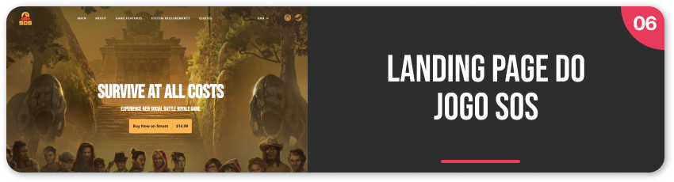

<h1 align="center">
  Twitch Live
</h1>

<h3 align="center">
  Projetos desenvolvidos em livecoding na <a href="https://www.twitch.tv/leovargasdev">Twitch.tv</a>
</h3>

<ul>
  <li><a href="#live-06">Live 06 • Jogo SOS</a></li>
  <li><a href="#live-03">Live 03 • A viagem de Chihiro</a></li>
  <li><a href="#live-02">Live 02 • Rocky's Burger</a></li>
  <li><a href="#live-01">Live 01 • Safe Travel</a></li>
  <!-- <li></li> -->
</ul>

 

<a href="https://www.github.com/leovargasdev/lives-twitch/live-06">
  

    
  

</a>

 

<a href="https://www.github.com/leovargasdev/lives-twitch/live-03">
  

    
  

</a>

 

<a href="https://www.github.com/leovargasdev/lives-twitch/live-02">
  

    
  

</a>

 

<a href="https://www.github.com/leovargasdev/lives-twitch/live-01">
  

    
  

</a>