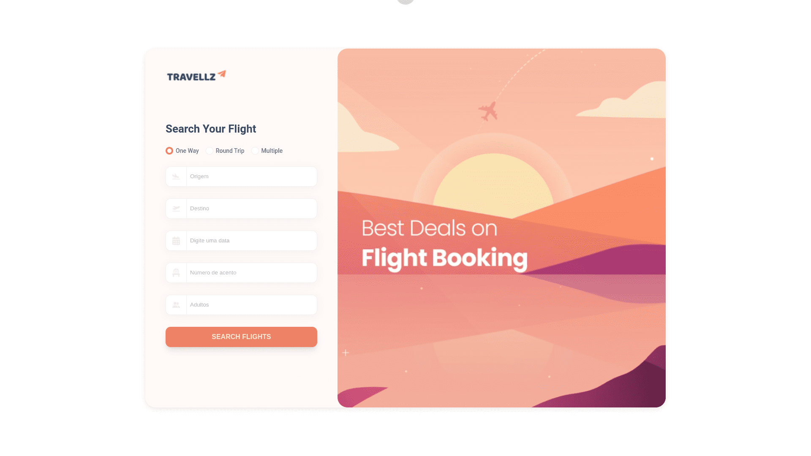

<h1 align="center">
  Live 08 • Formulário do Travellz
</h1>

  <a href="https://live-08.leonardovargas.dev/">
    <b>🚀 Visualizar</b>
  </a>
  &nbsp;&nbsp;▪&nbsp;&nbsp;
  <a href="">
    <b>💻 Repositório</b>
  </a>
  &nbsp;&nbsp;▪&nbsp;&nbsp;
  <a href="https://dribbble.com/shots/17153173-Travellz-flight-booking-app">
    <b>🎨 Protótipo</b>
  </a>
  &nbsp;&nbsp;▪&nbsp;&nbsp;
  <a href="">
    <b>🎥 VOD's</b>
  </a>

  

<h3 align="center">
  Design by: 🙅‍♀️
  <a href="https://dribbble.com/galaxyux">
     Galaxy UX Studio
  </a>
</h3>

### Funcionalidades em Aberto

- [x] Criar estrutura do página
- [x] Efeito de focus input
- [x] Componente de `Select`
- [x] Criar um Regex no input `Calendary`