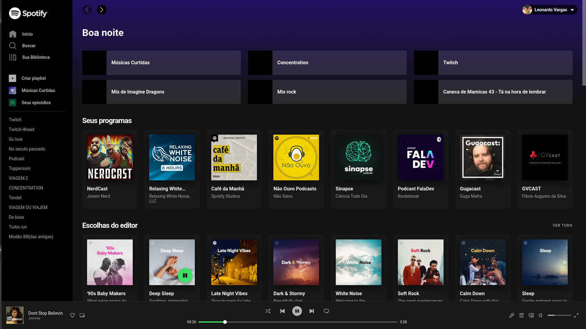

<h1 align="center">
  Live 09 • UI Clone Spotify
</h1>

  <a href="https://spotify.leonardovargas.dev/">
    <b>🚀 Visualizar</b>
  </a>
  &nbsp;&nbsp;▪&nbsp;&nbsp;
  <a href="https://github.com/leovargasdev/spotify-clone">
    <b>💻 Repositório</b>
  </a>
  &nbsp;&nbsp;▪&nbsp;&nbsp;
  <a href="https://open.spotify.com/">
    <b>🎨 Protótipo</b>
  </a>
  &nbsp;&nbsp;▪&nbsp;&nbsp;
  <a href="https://www.twitch.tv/collections/goY9U7YL1xZaUA">
    <b>🎥 VOD's</b>
  </a>

  

<h3 align="center">
  Design by: 🙅‍♀️
  <a href="https://developer.spotify.com/documentation/general/design-and-branding/">
     Spotify
  </a>
</h3>