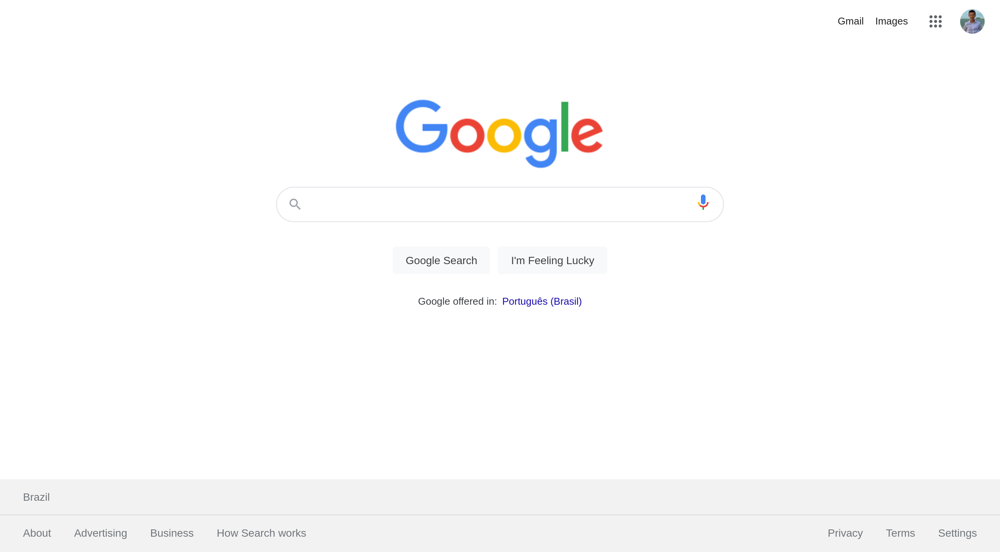

<h1 align="center">
  UI CLONE - Google
</h1>

  <a href="https://google.leonardovargas.dev/">
    <b>🚀 Visualizar</b>
  </a>
  &nbsp;&nbsp;▪&nbsp;&nbsp;
  <a href="https://github.com/leovargasdev/google">
    <b>💻 Repositório</b>
  </a>
  &nbsp;&nbsp;▪&nbsp;&nbsp;
  <a href="https://google.com">
    <b>🎨 Protótipo</b>
  </a>
  &nbsp;&nbsp;▪&nbsp;&nbsp;
  <a href="https://youtu.be/fggcHsk-4nw">
    <b>🎥 Vídeo no youtube</b>
  </a>

  

